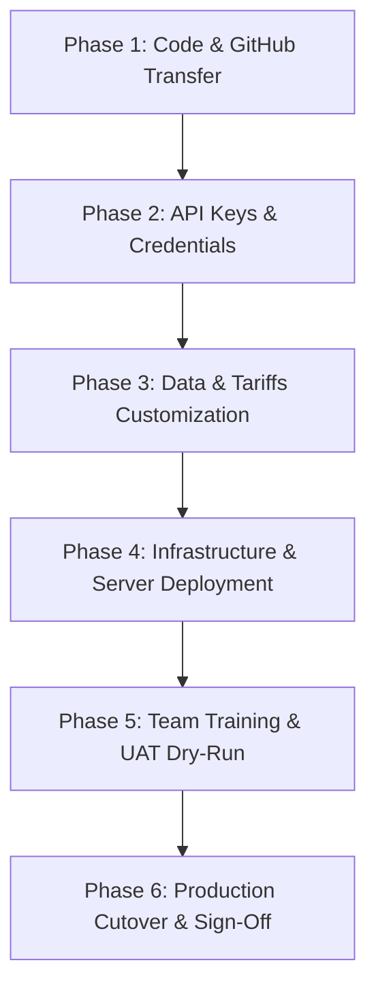

# Step-by-Step Handover Execution Runbook

This guide outlines the exact, step-by-step process for handing over the DMC Operations Platform to your engineering team, travel operations staff, and executive stakeholders.

---

## Handover Execution Roadmap



---

## Phase 1: Codebase & GitHub Transfer (Day 1)

### Objective
Transfer the version-controlled repository to your organization's official GitHub account with automated CI verification.

1. **Create GitHub Repository**:
   - Go to [GitHub $\rightarrow$ New Repository](https://github.com/new).
   - Set repository name: `dmc-workflow-automation`.
   - Set visibility to **Private** (recommended for operational systems containing supplier tariffs).
   - Do **NOT** initialize with a README, `.gitignore`, or license (already included).

2. **Push the Local Codebase**:
   Open PowerShell or Terminal in the project root:
   ```bash
   cd "C:\Users\Latitude E5470\.gemini\antigravity\scratch\dmc-workflow-automation"
   git remote add origin https://github.com/YOUR_ORGANIZATION/dmc-workflow-automation.git
   git push -u origin main
   ```

3. **Verify GitHub Actions CI Pipeline**:
   - Navigate to the **Actions** tab in GitHub.
   - Ensure the `DMC Platform CI` workflow executes and passes all test matrix steps (Python 3.11, 3.12, 3.13, syntax validation, and formula assertions).

4. **Assign Team Permissions**:
   - Go to **Settings $\rightarrow$ Collaborators and teams**.
   - Add developers with `Write` or `Admin` access.
   - Add operations leads with `Read` access.

---

## Phase 2: Environment & Third-Party API Configuration (Day 2)

### Objective
Connect your DMC's production communication and payment gateways.

1. **Create the Production Environment File**:
   ```bash
   cp .env.example .env
   ```

2. **Configure Required API Keys**:
   | Service | Configuration Variable | Source / Portal |
   |---|---|---|
   | **WhatsApp Gateway** | `TWILIO_ACCOUNT_SID`, `TWILIO_AUTH_TOKEN`, `TWILIO_WHATSAPP_FROM` | [Twilio Console](https://console.twilio.com) (or Meta WhatsApp Cloud API) |
   | **Deposit Checkout** | `STRIPE_SECRET_KEY` | [Stripe Dashboard $\rightarrow$ API Keys](https://dashboard.stripe.com/apikeys) |
   | **Flight Radar** | `AVIATIONSTACK_API_KEY` | [AviationStack API](https://aviationstack.com) |
   | **Email Intake** | `SMTP_HOST`, `SMTP_PORT`, `SMTP_USER`, `SMTP_PASS` | Google Workspace or Microsoft 365 App Password |
   | **AI Quoting Engine** | `OPENAI_API_KEY` or `GEMINI_API_KEY` | OpenAI Platform / Google AI Studio |

3. **Configure Stripe Webhooks**:
   - In Stripe Dashboard $\rightarrow$ **Developers $\rightarrow$ Webhooks**, add an endpoint:
     `https://dmc.yourdomain.com/api/webhooks/stripe`
   - Select event: `checkout.session.completed`.

---

## Phase 3: Data & Tariffs Customization (Day 3)

### Objective
Replace the mock Amalfi Coast demo tariffs with your company's actual contracted supplier rates.

1. **Update Supplier Directory (`sample_data/suppliers_sample.csv`)**:
   - Replace demo names with your real ground partners (transport companies, licensed guide guilds, hotel reservations managers, boat charters).
   - Enter their real mobile phone numbers in the `whatsapp_number` column (international format: `+1...`, `+39...`, `+33...`).

2. **Update Contract Tariffs (`sample_data/tariffs_sample.csv`)**:
   - Enter your negotiated net costs for airport transfers, hourly chauffeur disposal, hotel room categories (high/low season), and private excursions.
   - Verify cancellation policy notes.

3. **Re-Seed the Database**:
   ```bash
   # Remove demo database and re-seed with your real contracts:
   python -c "import os; os.remove('dmc_operations.db') if os.path.exists('dmc_operations.db') else None"
   python db.py
   ```

---

## Phase 4: Infrastructure & Server Deployment (Day 4)

### Objective
Deploy the platform on your production virtual private server (VPS) or cloud infrastructure.

### Recommended: Docker Compose
1. SSH into your production server (e.g. AWS EC2, DigitalOcean Droplet, or Hetzner VPS):
   ```bash
   git clone https://github.com/YOUR_ORGANIZATION/dmc-workflow-automation.git /var/www/dmc
   cd /var/www/dmc
   cp .env.example .env
   # Edit .env with production keys
   ```

2. Launch containers:
   ```bash
   docker compose up -d --build
   ```

3. Import n8n Workflow Blueprints:
   - Open `http://your-server-ip:5678` in your browser.
   - Create your master n8n admin account.
   - Go to **Workflows $\rightarrow$ Import from File**.
   - Import the 3 blueprints from `workflows/`:
     - `01_inquiry_to_proposal.json`
     - `02_supplier_confirmation_and_vouchers.json`
     - `03_daily_operations_manifest.json`
   - Activate all three workflows.

4. Set up Reverse Proxy & Free SSL with Caddy:
   ```caddy
   dmc.yourdomain.com {
       reverse_proxy localhost:8080
   }
   workflows.yourdomain.com {
       reverse_proxy localhost:5678
   }
   ```

---

## Phase 5: Team Training & UAT Dry-Run (Day 5)

### Objective
Walk the operational staff through real-world scenarios to ensure confidence and autonomy.

### Scenario 1: Sales / Travel Designer Training
* **Action**: Open the Command Dashboard $\rightarrow$ **1. AI Intake & Quoting Hub**.
* **Exercise**: Paste a real incoming client inquiry email.
* **Review**:
  - Show how AI extracts pax count, dates, and destination.
  - Demonstrate the **Profit Margin Slider** (show how gross selling price and TOMS VAT adjust in real time).
  - Click **"Preview Proposal"** and **"📱 Guest Portal"** to show what the client sees on mobile.

### Scenario 2: Ground Operations Training
* **Action**: Navigate to **2. Supplier Booking & Vouchers**.
* **Exercise**: Show how marking a deal as won automatically triggers WhatsApp confirmation pings to the assigned chauffeur and guide.
* **Review**: Show the 1-click **Confirm** / **Decline** screen and inspect the generated ground voucher.

### Scenario 3: Daily Dispatch & Flight Radar Training
* **Action**: Navigate to **3. Operations & Daily Manifests**.
* **Exercise**: Show how tomorrow's driver run-sheets are aggregated.
* **Exercise**: Click **"Poll Flight Radar & Reschedule"** on Stop #1 to demonstrate how a delayed arrival flight (`AZ 1284`) automatically shifts driver pickup times and sends a WhatsApp alert.

---

## Phase 6: Production Cutover & Sign-Off (Day 6)

### Objective
Formal transition of ownership and ongoing maintenance.

### Handover Checklist
- [ ] Codebase pushed to client/organization GitHub repository.
- [ ] GitHub Actions CI pipeline passing green.
- [ ] Production `.env` configured and verified.
- [ ] Production database seeded with real supplier tariffs.
- [ ] SSL certificates active (`https://dmc.yourdomain.com`).
- [ ] Automated daily database backup cron established:
  ```bash
  # In server crontab:
  0 2 * * * sqlite3 /var/www/dmc/dmc_operations.db ".backup '/var/backups/dmc_$(date +\%Y\%m\%d).db'"
  ```
- [ ] Operations team trained on Quoting Hub, Supplier Station, and Manifest Center.
- [ ] Client / Stakeholder approval and sign-off recorded.

---

## Contact & Ongoing Support
For questions or architectural adjustments post-handover, consult:
- **Primary Technical Documentation**: [`HANDOVER.md`](HANDOVER.md)
- **Database Schema Reference**: [`data_schema.md`](data_schema.md)
- **Setup & Commands**: [`README.md`](README.md)
