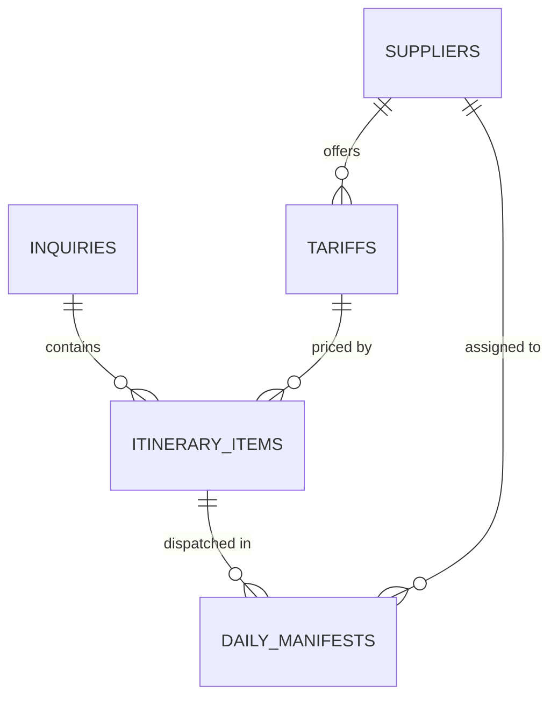

# DMC Operational Data Schema

This schema defines the essential entities, fields, relationships, and lifecycle states required to run an automated Destination Management Company (DMC). It is optimized for Airtable, Google Sheets, or relational databases (PostgreSQL/Supabase).

---

## Entity Relationship Overview

---

## 1. Table: `Inquiries` (Master Bookings)

Represents each client request from initial RFP through to quotation, booking, and post-trip.

| Field Name | Type | Notes / Valid Values |
|---|---|---|
| `inquiry_id` | Text (Primary Key) | Auto-generated ID (e.g. `INQ-2026-001`) |
| `client_name` | Text | Name of the B2B tour operator, travel advisor, or lead guest |
| `client_email` | Email | Client's primary email |
| `client_country` | Text | Country of origin (e.g., `United States`, `UK`, `Germany`) |
| `pax_adults` | Number | Count of adults (age 12+) |
| `pax_children` | Number | Count of children (age 2–11) |
| `pax_infants` | Number | Count of infants (under 2) |
| `travel_start_date` | Date | Projected arrival date |
| `travel_end_date` | Date | Projected departure date |
| `destination` | Text / Multi-select | Main destination region (e.g., `Amalfi Coast`, `Kyoto & Tokyo`, `Safari Kenya`) |
| `budget_currency` | Single Select | `USD`, `EUR`, `GBP`, etc. |
| `target_budget` | Currency / Number | Budget indicator provided by client |
| `service_tier` | Single Select | `Standard`, `Superior`, `Luxury`, `Ultra-VIP` |
| `special_requests` | Long Text | Dietary, mobility, celebration notes, flight details |
| `status` | Single Select | `New RFP`, `Parsing AI`, `Proposal Drafted`, `Proposal Sent`, `Won / Deposit Paid`, `In Operation`, `Completed`, `Lost` |
| `net_total_cost` | Rollup / Currency | Sum of all `Itinerary_Items.net_total_cost` |
| `margin_percentage` | Number / Percentage | Target margin (e.g., `20%` or `0.20`) |
| `gross_selling_price` | Formula | `net_total_cost / (1 - margin_percentage)` |
| `proposal_pdf_url` | URL | Link to generated itinerary PDF |
| `created_at` | DateTime | Timestamp of inquiry receipt |

---

## 2. Table: `Suppliers` (Directory)

Local partner directory covering all ground service providers.

| Field Name | Type | Notes / Valid Values |
|---|---|---|
| `supplier_id` | Text (Primary Key) | e.g. `SUP-HTL-001`, `SUP-TRN-002` |
| `name` | Text | e.g. `Grand Hotel Excelsior`, `Elite Chauffeurs Ltd`, `Alpine Guides Guild` |
| `category` | Single Select | `Accommodation`, `Transport`, `Licensed Guide`, `Activity/Excursion`, `Restaurant`, `Boat Charter` |
| `location` | Text | City, region, or operating zone |
| `contact_person` | Text | Reservations manager / Dispatch lead |
| `contact_email` | Email | Email for booking vouchers |
| `contact_phone` | Phone Number | International format (e.g. `+393331234567`) |
| `whatsapp_number` | Phone Number | International format used for instant 1-click confirmation pings |
| `payment_terms` | Single Select | `Prepayment Required`, `Net 14 Days`, `Net 30 Days`, `On Arrival` |
| `rating` | Number (1–5) | Quality rating from past operations |

---

## 3. Table: `Tariffs` (Contract Rates)

Your agreed contract rates with local suppliers.

| Field Name | Type | Notes / Valid Values |
|---|---|---|
| `tariff_id` | Text (Primary Key) | e.g. `TAR-TRN-AP01`, `TAR-HTL-DLX` |
| `supplier_id` | Link to `Suppliers` | Supplier providing this service |
| `service_title` | Text | e.g. `Airport Transfer Mercedes E-Class`, `Full-Day Private City Walking Tour (4h)` |
| `category` | Single Select | `Transport`, `Accommodation`, `Guide`, `Activity` |
| `pricing_unit` | Single Select | `Per Person`, `Per Vehicle`, `Per Room / Night`, `Per Group` |
| `currency` | Single Select | `USD`, `EUR`, `GBP`, `JPY`, etc. |
| `net_rate` | Currency / Number | DMC purchase cost from supplier |
| `valid_from` | Date | Tariff validity start |
| `valid_to` | Date | Tariff validity end (seasonality expiration) |
| `cancellation_policy` | Text | e.g. `Free cancellation up to 48h prior` |

---

## 4. Table: `Itinerary_Items` (Quotation Line Items)

Day-by-day components attached to each inquiry/booking.

| Field Name | Type | Notes / Valid Values |
|---|---|---|
| `item_id` | Text (Primary Key) | Auto ID (e.g. `ITM-2026-001-D1`) |
| `inquiry_id` | Link to `Inquiries` | Parent inquiry/booking |
| `day_number` | Number | `Day 1`, `Day 2`, etc. |
| `service_date` | Date | Specific calendar date of the service |
| `service_time` | Time | Pickup or reservation time |
| `tariff_id` | Link to `Tariffs` | Contracted rate applied |
| `supplier_id` | Link to `Suppliers` | Service provider |
| `service_title` | Text | Display title on client proposal |
| `service_description` | Long Text | Descriptive copy and highlights for client |
| `quantity` | Number | Number of rooms, vehicles, or guests |
| `unit_cost_net` | Currency | Sourced from Tariff |
| `net_total_cost` | Formula | `quantity * unit_cost_net` |
| `supplier_status` | Single Select | `Pending Dispatch`, `Request Sent`, `Confirmed`, `Declined`, `Cancelled` |
| `confirmation_token` | Text | Unique secure UUID for 1-click supplier response |
| `voucher_number` | Text | Generated when confirmed (e.g. `VOUCH-2026-9481`) |

---

## 5. Table: `Daily_Manifests` (Field Dispatch)

Driver and guide run-sheets generated daily for ground operations.

| Field Name | Type | Notes / Valid Values |
|---|---|---|
| `manifest_id` | Text (Primary Key) | e.g. `MAN-20260915-DRV01` |
| `date` | Date | Service date (typically tomorrow's date) |
| `resource_type` | Single Select | `Driver`, `Tour Guide`, `Airport Rep` |
| `resource_name` | Text | Assigned driver/guide name |
| `resource_phone` | Phone Number | Mobile for WhatsApp manifest dispatch |
| `vehicle_plate` | Text | License plate and vehicle model (if transport) |
| `assigned_items` | Link to `Itinerary_Items` | All pickups/tours assigned to this resource |
| `flight_number` | Text | Incoming flight number (if transfer) |
| `flight_status` | Single Select | `On Time`, `Delayed`, `Landed`, `Not Applicable` |
| `dispatch_status` | Single Select | `Draft`, `Sent to Field`, `Acknowledged by Staff` |
| `dispatched_at` | DateTime | Timestamp when manifest was messaged to field staff |
